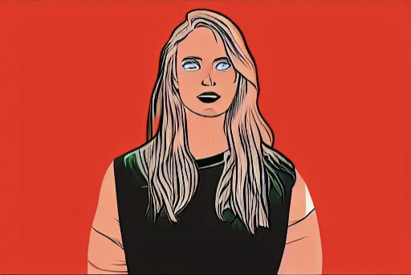
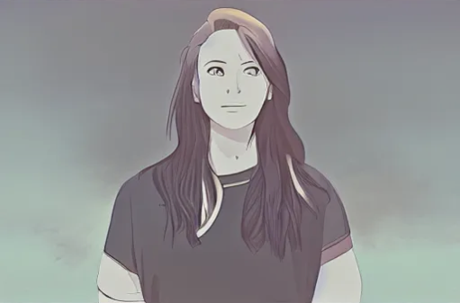
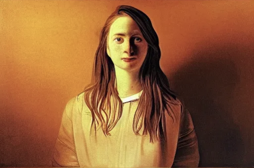
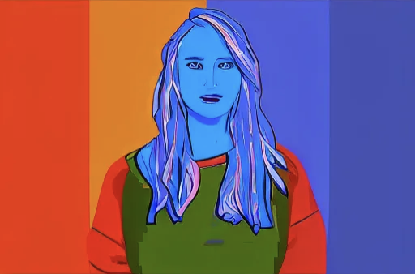
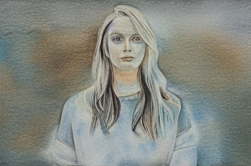

# 🎨 Morphix – Portrait Style Transformation with Stable Diffusion + ControlNet

**Morphix** is an AI app that lets you upload a **portrait photo** and transform it into different **artistic styles** (Comic, Anime, Oil Painting, Pixel Art, Watercolor).  
It uses **Stable Diffusion + ControlNet (Canny)** to preserve structure while changing the artistic look.

---

## ✨ Features
- Upload any portrait photo.
- Choose from 5 pre-defined artistic styles.
- Adjustable **guidance scale** and **inference steps** for creativity vs. accuracy.
- Runs interactively in your browser via **Gradio**.
- Ready to deploy on **Hugging Face Spaces**.

---

## 🛠️ Tech Stack
- **Python 3.9+**
- **PyTorch** with CUDA
- **Hugging Face Diffusers** (Stable Diffusion + ControlNet)
- **Gradio** for UI
- **OpenCV** for edge detection

---

## 📦 Installation

Clone the repository and install dependencies:  

```bash
git clone https://github.com/yourusername/Morphix.git
cd Morphix
pip install -r requirements.txt
```

Or using conda:
```bash
conda create -n morphix python=3.10 -y
conda activate morphix
pip install -r requirements.txt
```

### Run the Gradio app locally:
```bash
python app.py
```

---

## 🖼️ Examples

*Here’s how one portrait can take on five completely different looks using Morphix’s style options.  
See below as the same photo is reimagined as Comic, Anime, Oil Painting,
Pixel Art, and Watercolor styles.*

<div style="display: flex; flex-wrap: wrap; gap: 12px; justify-content: center;">

  <figure style="margin: 0; text-align: center;">
    <div style="margin-bottom: 4px;">Input Portrait</div>
    
  </figure>

  <figure style="margin: 0; text-align: center;">
    <div style="margin-bottom: 4px;">Comic Style</div>
    
  </figure>

  <figure style="margin: 0; text-align: center;">
    <div style="margin-bottom: 4px;">Anime Style</div>
    
  </figure>

  <figure style="margin: 0; text-align: center;">
    <div style="margin-bottom: 4px;">Oil Painting Style</div>
    
  </figure>

  <figure style="margin: 0; text-align: center;">
    <div style="margin-bottom: 4px;">Pixel Art Style</div>
    
  </figure>

  <figure style="margin: 0; text-align: center;">
    <div style="margin-bottom: 4px;">Watercolor Style</div>
    
  </figure>

</div>

**Note:**  
For all examples, the **guidance scale** and **inference steps** were kept at their default values:  
- Guidance scale: **7.5**  
- Inference steps: **30**

**Input photo source:** [Freepik – Adorable blonde woman with serious expression](https://www.freepik.com/free-photo/adorable-blonde-woman-with-serious-expression-dressed-blue-sweater-has-healthy-clean-skin-isolated-white-wall-pretty-woman-demonstrates-her-natural-beauty_10545097.htm#fromView=keyword&page=1&position=12&uuid=53998ca6-2c3a-4953-b327-bacd132d4a24&query=Woman+portrait)
